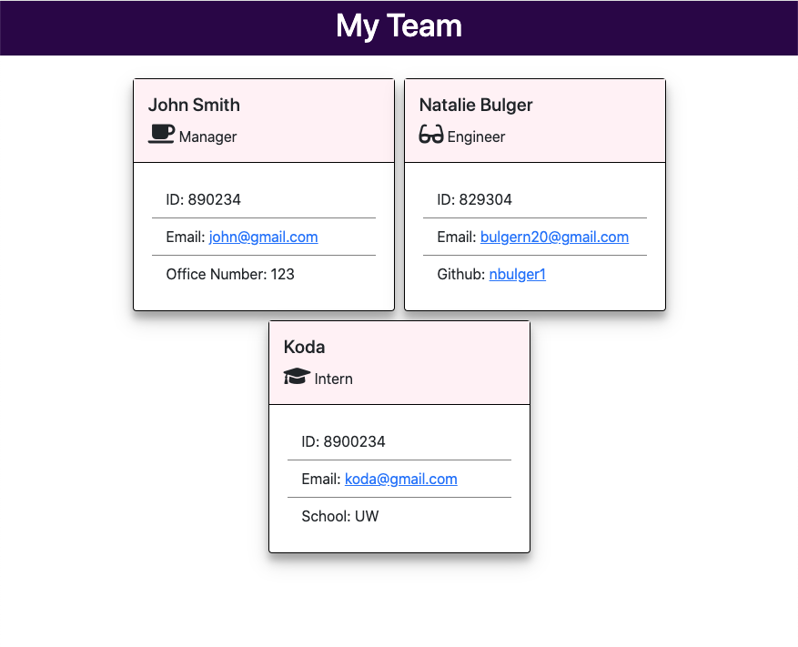

## Team Profile Generator - Week 10 Homework

## Description

I was tasked to create a command-line application that takes information, provided by a user, about a software engineering team and generates an HTML webpage with a summary on each person. I was also tasked to write tests for different parts of my code to help make the code maintainable in the future.

## Table of Contents

- [User Story](#user-story)
- [Acceptance Criteria](#acceptance-criteria)
- [Node Package Manager](#node-package-manager)
- [Prompt Questions](#prompt-questions)
- [Classes](#classes)
- [HTML](#html)
- [Tests](#tests)
- [License](#license)
- [Walkthrough Video](#walkthrough-video)
- [Sample Profile](#sample-profile)

## User Story

```md
AS A manager
I WANT to generate a webpage that displays my team's basic info
SO THAT I have quick access to their emails and GitHub profiles
```

## Acceptance Criteria

```md
GIVEN a command-line application that accepts user input
WHEN I am prompted for my team members and their information
THEN an HTML file is generated that displays a nicely formatted team roster based on user input
WHEN I click on an email address in the HTML
THEN my default email program opens and populates the TO field of the email with the address
WHEN I click on the GitHub username
THEN that GitHub profile opens in a new tab
WHEN I start the application
THEN I am prompted to enter the team manager’s name, employee ID, email address, and office number
WHEN I enter the team manager’s name, employee ID, email address, and office number
THEN I am presented with a menu with the option to add an engineer or an intern or to finish building my team
WHEN I select the engineer option
THEN I am prompted to enter the engineer’s name, ID, email, and GitHub username, and I am taken back to the menu
WHEN I select the intern option
THEN I am prompted to enter the intern’s name, ID, email, and school, and I am taken back to the menu
WHEN I decide to finish building my team
THEN I exit the application, and the HTML is generated
```

## Node Package Manager

To start, I installed the necessary packages for this application from npm including "inquirer" for command-line prompting and "jest" for testing. These packages were then required in my index.js file at the top of the file.

## Prompt Questions

The questions used in the npm inquirer were put into a question array within the index.js file. The first question asks for an employee type to determine future questions, as some questions are only asked for certain employees. I also added in validation for the employee's email. For future development, I would like to validate more of the user inputs.

## Classes

I made one overarching class called Employee and then three subclasses of Employee called Engineer, Intern, and Manager. All of these Javascript files live in the "lib" folder. The Employee class included the name, email, and employee id of each member of the team. The Engineer class extended Employee to add Github Username and URL. The Intern class extended Employee to add school. The manager class extended Employee to add an office number. All of these classes have different methods that could be tested using jest. The Employee class have a getName, getEmail, getId, and getRole method. The Engineer, Manager, and Intern classes have a getGithub, getOfficeNumber, and getSchool method respectively. The Engineer, Manager, and Intern classes also have a getRole method that overrides the getRole method in the Employee class. All methods were tested using jest (see #tests section of README).

## HTML

There are four different functions that handle html in the index.js file. Three of them utilize the information provided by the user to create different cards for each type of employee. Each of these card creating functions loops through the associated employee array to generate a group of appended template literals of HTML for the employees. Those three functions are called within the writeToHtml function which has the remaining HTML necessary to create the webpage output in the form of a template literal. The writeToHtml file is called in the initializing function when the user confirms they are done added employees to their team.

## Tests

To test the various methods within each of the employee classes, I created four different test files in the "test" folder. Each file tests the associated javascript file from the "lib" folder. I made sure to test each method for each class, including the getRole method to ensure that it was overriding the superclass. In total I have 4 test suites and 11 tests, all which pass as shown in the demonstration.

## License

[](https://opensource.org/licenses/MIT)

This project is protected under the MIT License.

## Walkthrough Video

https://youtu.be/5rVo6Y9TCOY

## Sample Profile

The sample HTML file is in the Github repository under the "dist" folder called "index.html". See below for a screen shot of the sample page:


